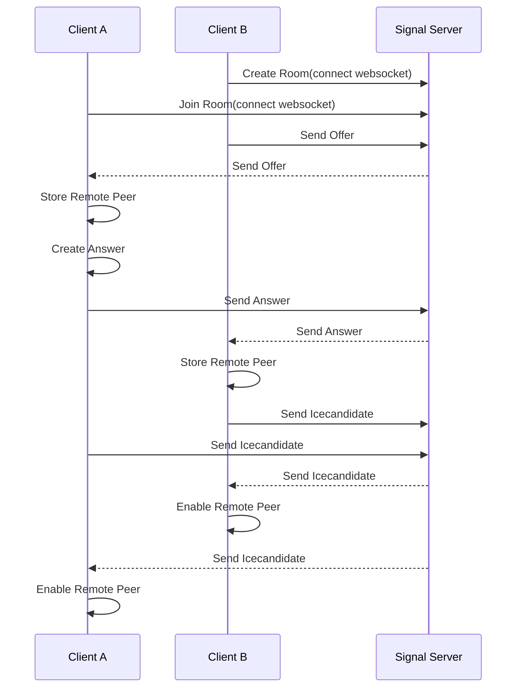

## WebRTC Demonstration Project

This project demonstrates video chat feature with WebRTC protocol.


## How to run

install dependencies in ./server-signal and ./front
```
npm or yarn install
```

run signal server in server-signal directory
```
npm run start or yarn start
```

run front
```
npm run dev or yarn dev
```

## Sequence diagram



## Usage

you can create or join the name of the room you want to chat with. If you are connected to the other person, you can see remote video screen.

## Do you want to publish?

If you want to expand this project and run it on a real server, you will need to use the address of the actual workable turn server for the setting of the RTC Configuration in the front project, and it is recommended that you have an address with HTTPS protocol applied.
