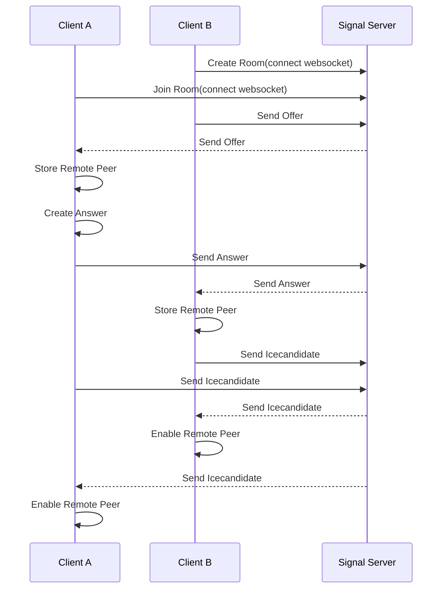

## WebRTC Demonstration Project

This project was implemented using webRTC technology to use voce, video and text chat between users in peer to peer.

This project is monorepo architecture and have below architecture like.

```
root
│   package.json
└───common
│
└───front
│
└───server-signal
```

## How to run

install dependecies in root
```
npm or yarn install
```

run signal server in server-signal directory
```
npm run start or yarn start
```

run front
```
npm run start or yarn start
```

## Sequence diagram



## Usage

First, you can create or join the name of the room you want to chat with. If you are connected to the other person, you can use the chat pop-up on the bottom right to chat and video chat.

## Do you want to publish?

If you want to expand this project and run it on a real server, you will need to use the address of the actual workable turn server for the setting of the RTC Configuration in the front project, and it is recommended that you have an address with HTTPS protocol applied.

## To do list
- Implement chat ui on the right side for desktop version not using react-chat-widget
- Implement join and left user event and notify to users
- Implement speaking effect ui
- Change create join room logic to only have join logic
  - even there is no room that user want to join that should be created room
- Upgrade responsive grid video ui
