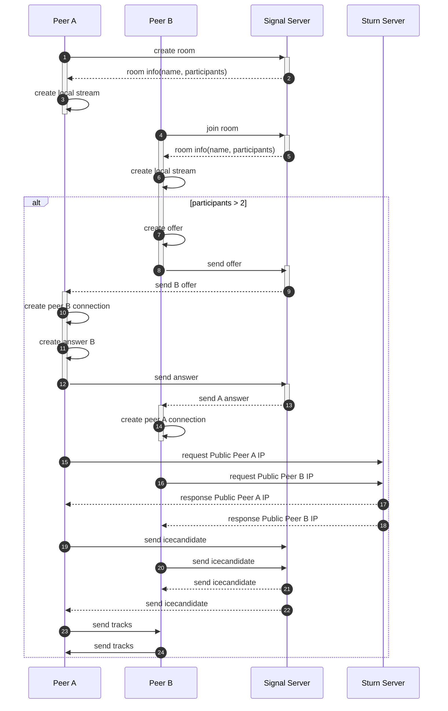

## WebRTC Demonstration Project

This project is a program that can send and receive voice and video data in real time between users using WebRTC (Web Real-Time Communication). The biggest feature of this project is that it can communicate in a peer-to-peer (P2P) way without going through a main server.

## Features
- **Deploy responsive UI**: I have built a responsive UI to deliver an optimal user experience across various devices. It provides consistent design and seamless functionality on both desktop and mobile environments, adapting flexibly to different screen sizes.
- **Real-time voice and video streaming**: It has implemented high-quality voice and video output functions for real-time communication between users. It utilizes WebRTC technology to enable direct data transmission between clients, providing a fast and reliable streaming environment.
- **Chat room creation and engagement**: It provides the ability for users to freely create chat rooms and participate in conversations with other users. It supports real-time communication and facilitates smooth interaction between users for various situations.
- **Socket communication data validation with servers**: In client-to-server communication, it thoroughly validates the data types required by the server, ensuring data integrity and maintaining reliable communication.
- **Transfer of real-time voice and video data based on WebRTC**: Using WebRTC, I implemented the ability to send and receive voice and video data between clients in real time. It operates in a P2P manner without going through a central server, minimizing latency and maximizing network efficiency.

## How to run

install dependencies in ./server-signal and ./front
```
npm or yarn install
```

run signal server in server-signal directory
```
npm run start or yarn start
```

run front
```
npm run dev or yarn dev
```

## PORT

- front 5173
- signal-server 8081

## Sequence diagram



## Usage

you can create or join the name of the room you want to chat with. If you are connected to the other person, you can see remote video screen.

## Do you want to publish?

If you want to expand this project and run it on a real server, you will need to use the address of the actual workable turn server for the setting of the RTC Configuration in the front project, and it is recommended that you have an address with HTTPS protocol applied.

## Demo video

